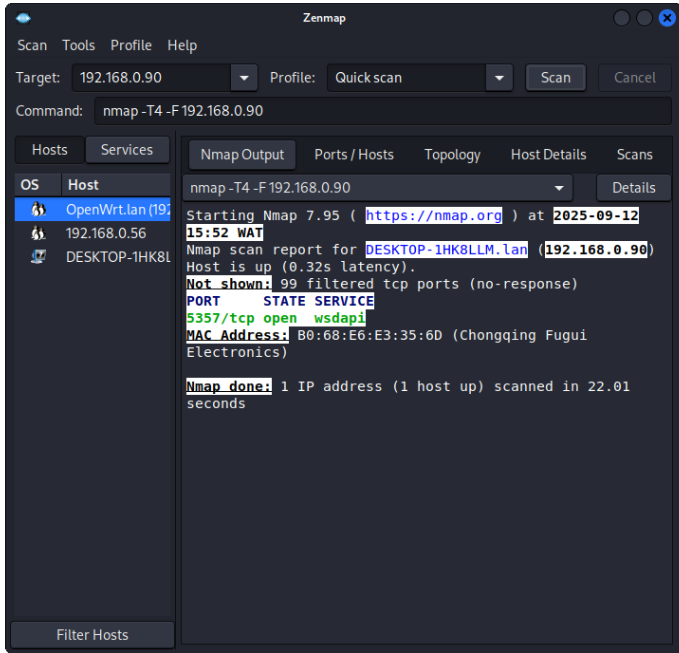
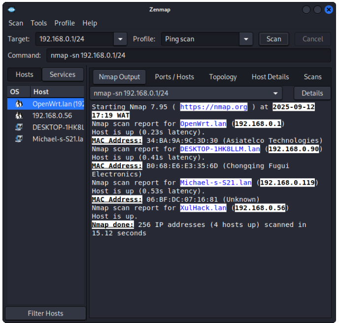
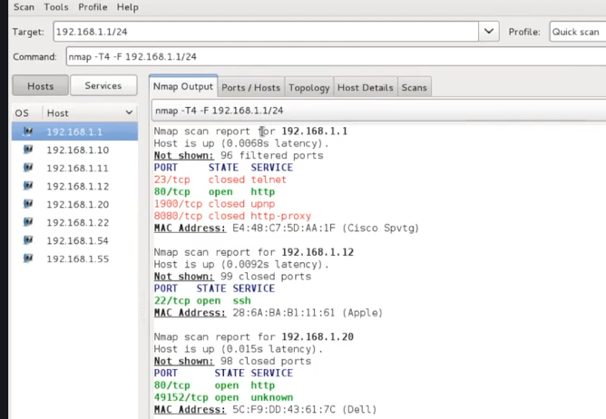
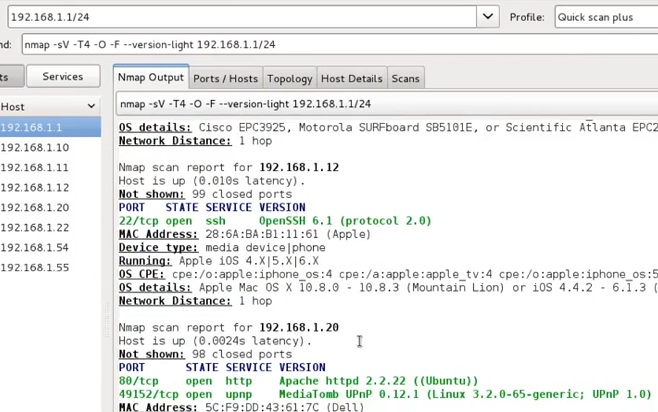

# Nmap Basic Scan Lab

## Objective
To learn how to scan a network and identify open ports using Nmap.

## Tool Used
- Nmap/Zenmap

## Steps Performed
1. Ran a basic scan command

**Observation**: When I ran nmap ping scan on a network to discover all the devices and it fails to discover all but when I ran *quick scan* on zenmap on a particular device IP that I know is online, the scan returned other hosts on the network
### Screenshot

Another normal ping scan of the network few hours later discovered all the connected devices
I later found out I needed to repeat the scan several times for it to discover all devices on the networks

### Screenshot

2. Ran a quick scan command

**Observation**: A lot of devices do not respond to ping requests even if they are alive

3. Ran a quick scan plus command

**Obervation**: The IOS device has an SSH server but by default iOS devices do not have an SSH server. Usually when you jailbreak the phone or the device it will automatically install an SSH server.
 

## What I Learned
- How to run a quick nmap scan to look for open ports using the command **nmap -sV --open -oA nibbles_initial_scan <ip address>**.
- How to use **(-sV)** scan against the default top 1,000 ports and only return open ports **(--open)**.
- How to output all scan formats using **-oA**
- How to  run a full TCP port scan using the command **nmap -p- --open -oA nibbles_full_tcp_scan 192.168.42.190.**,
- How to use **nc** to do some banner grabbing to confirms nmap output
- How to perform an nmap script scan using the **-sC** flag
- How to identify active services
- Importance of open ports in security
- Learned service version detection

